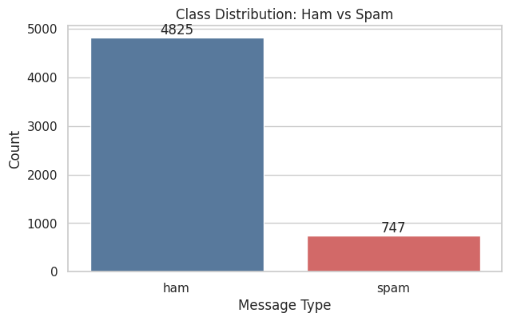
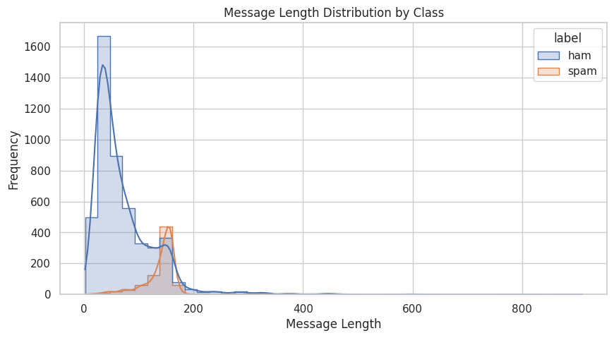
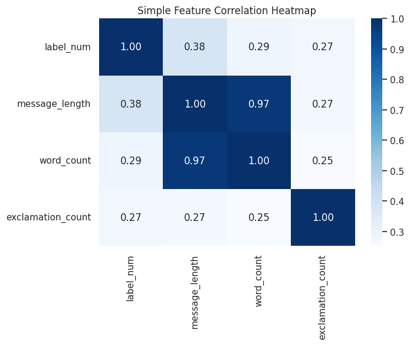
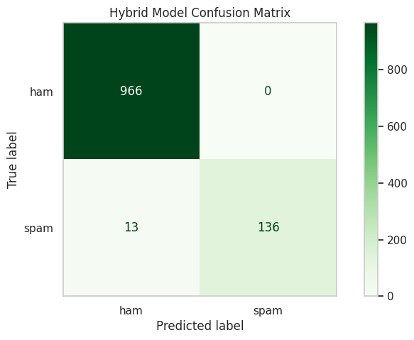
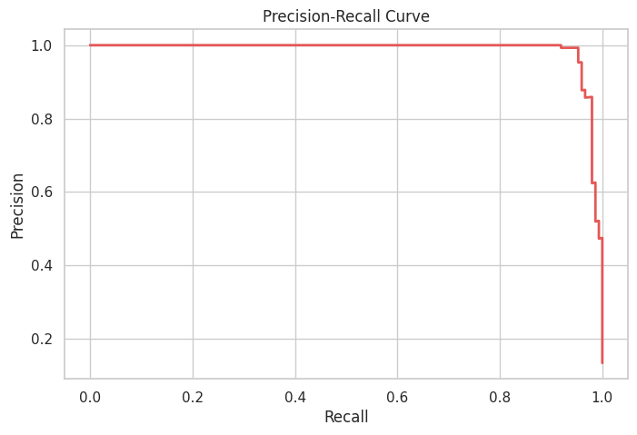
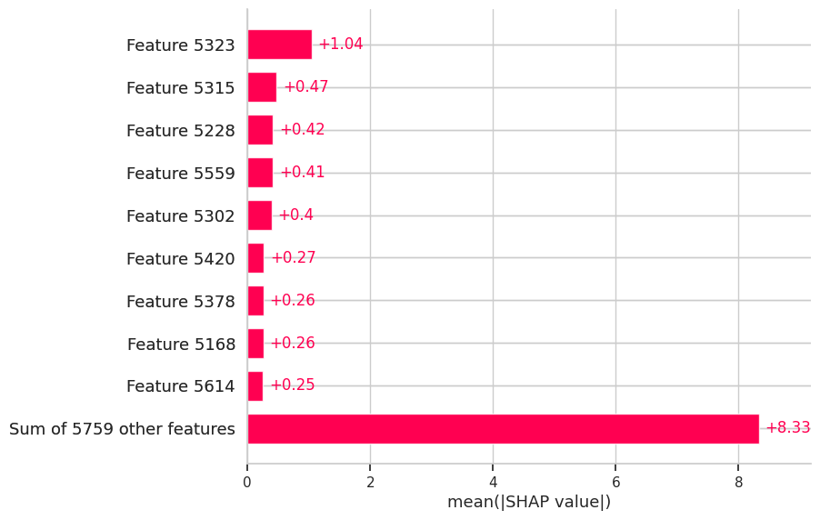

# Advanced Spam Email / SMS Detection

A notebook-driven machine learning project for classifying spam messages using a progression of text representations: **TF-IDF**, **handcrafted signals**, **BERT embeddings**, and **XGBoost**. The project also explores **probability calibration**, **threshold tuning**, **SHAP-based interpretation**, and a creative **graph-inspired feature** extension.

[Open the Colab notebook](https://colab.research.google.com/drive/1PKJwAwZ50F5eHQ_Dw-dc7CqMyFmJ_XWa?usp=sharing)

## Overview

This repository walks through a practical spam-detection pipeline from simple baseline modeling to a stronger hybrid classifier. The notebook is written as a readable project story, so it is useful both as a learning resource and as a reusable ML workflow.

The project uses the public SMS Spam Collection dataset and compares multiple stages of feature engineering:

- Baseline TF-IDF + Logistic Regression
- TF-IDF + handcrafted numeric features
- TF-IDF + BERT embeddings + XGBoost
- Probability-calibrated spam scoring
- Graph-augmented feature experiment

## Key Highlights

- Uses a public dataset with **5,572 messages**
- Splits data into **4,457 training** and **1,115 test** samples
- Builds a **5,000-feature TF-IDF** text representation
- Adds **768-dimensional BERT embeddings**
- Saves reusable model artifacts with `joblib`
- Includes model diagnostics such as confusion matrices, precision-recall analysis, SHAP, and error analysis

## Workflow

1. Load and inspect the dataset
2. Create simple exploratory visuals
3. Train a baseline TF-IDF model
4. Add handcrafted signals like message length, `!`, and `$`
5. Extract BERT embeddings from `bert-base-uncased`
6. Train a hybrid XGBoost classifier
7. Calibrate probabilities for better confidence scores
8. Review mistakes and interpret predictions with SHAP
9. Add graph-inspired text structure features as an extra experiment

## Tech Stack

- Python
- pandas, numpy
- matplotlib, seaborn
- scikit-learn
- xgboost
- transformers
- torch
- shap
- joblib

## Reported Results

The notebook reports the following milestone results on the held-out test set:

| Model Stage | Result |
| --- | --- |
| TF-IDF + Logistic Regression | **97.58% accuracy** |
| TF-IDF + handcrafted features | **97.04% accuracy** |
| TF-IDF + BERT + XGBoost | **0.99 accuracy in report**, **ROC-AUC = 0.9967** |
| Graph-augmented hybrid model | **98.83% accuracy** |

Other useful observations captured in the notebook:

- Suggested high-precision threshold: **0.0008**
- Misclassified test samples shown for error analysis: **13**
- Best grid-search parameters: `max_depth=4`, `n_estimators=100`

## Output Gallery

### Dataset and Feature Exploration





### Model Evaluation





### Final Comparison and Interpretation




## Project Files

```text
advance_spam_email/
|-- advance_spam_detection_BTP.ipynb
|-- readme.md
|-- spam_model_v2.pkl
|-- spam_model_calibrated.pkl
|-- tfidf.pkl
`-- assets/
    `-- output/
        |-- class_distribution.png
        |-- message_length_distribution.png
        |-- feature_correlation.png
        |-- baseline_confusion_matrix.png
        |-- baseline_vs_handcrafted.png
        |-- hybrid_confusion_matrix.png
        |-- precision_recall_curve.png
        |-- shap_summary.png
        `-- final_model_comparison.png
```

## Running the Notebook

1. Open `advance_spam_detection_BTP.ipynb` locally or in Colab.
2. Install the required packages from the notebook setup cell.
3. Run the cells in order.
4. The notebook downloads the SMS dataset automatically.
5. BERT weights are pulled from Hugging Face during execution.

Example install command used in the notebook:

```bash
pip install scikit-learn pandas numpy matplotlib seaborn scipy joblib transformers torch xgboost shap
```

## Saved Artifacts

- `tfidf.pkl` - trained TF-IDF vectorizer
- `spam_model_v2.pkl` - hybrid XGBoost classifier
- `spam_model_calibrated.pkl` - calibrated classifier for better probability estimates

## Important Note

The notebook's `predict_spam(...)` helper expects saved `bert_model/` and `bert_tokenizer/` directories. Those folders are referenced in the notebook but are **not currently present in this repository**, so you should rerun the save cells before using the helper exactly as written.

## Future Improvements

- Add a `requirements.txt` or `environment.yml`
- Commit the saved BERT tokenizer/model folders or switch inference to download them automatically
- Package inference into a small API or Streamlit app
- Add cross-validation summaries and reproducibility notes

## Authoring Note

This repository is strongest as a **learning + experimentation notebook** that shows how a spam classifier can evolve from a classical NLP baseline into a richer hybrid ML pipeline.
